# CRM Platform - Workflow & State Diagrams

## Complete Workflow Spine

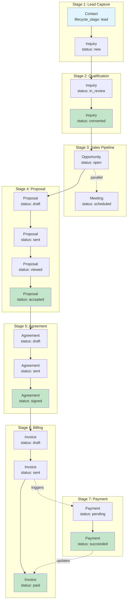

## State Machine: Contact Lifecycle

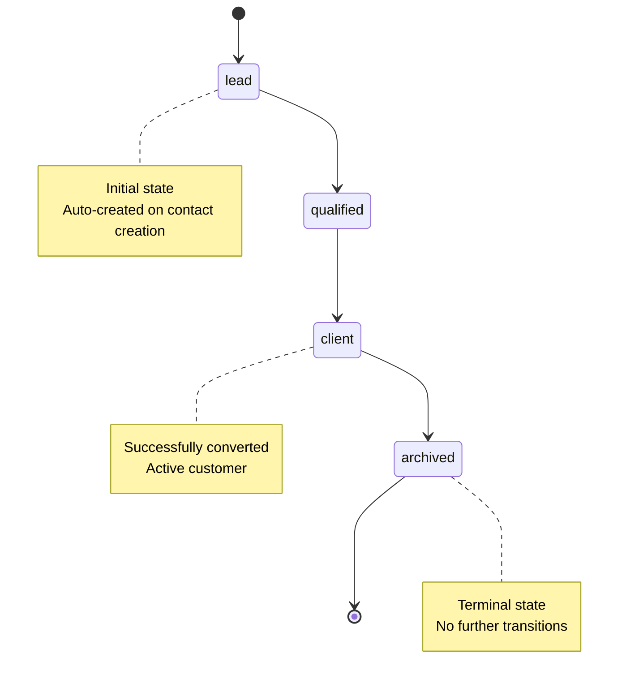

## State Machine: Inquiry

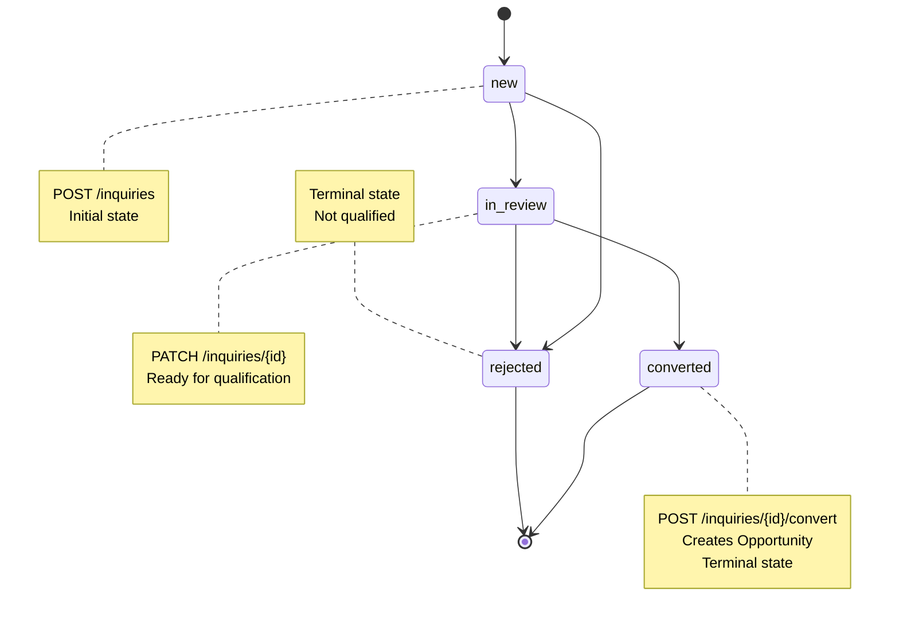

## State Machine: Opportunity

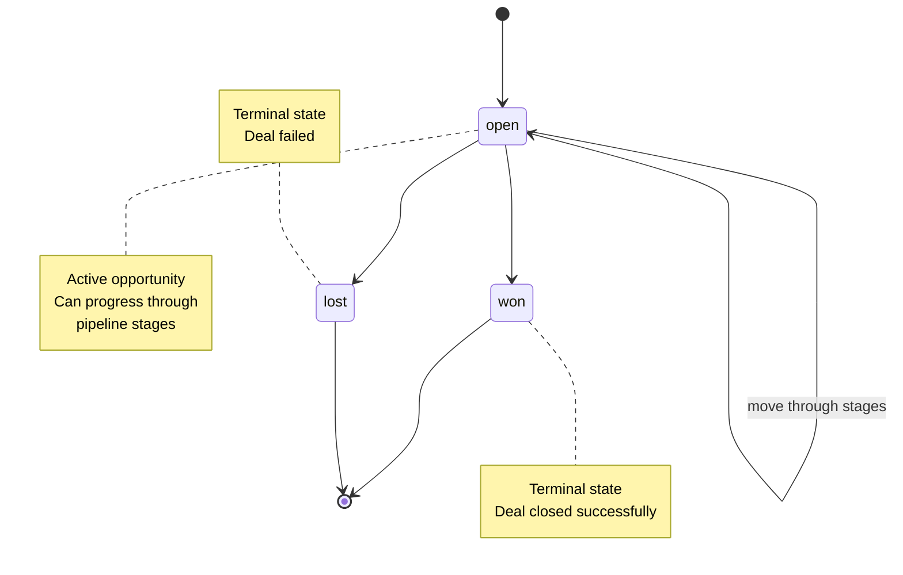

## State Machine: Proposal

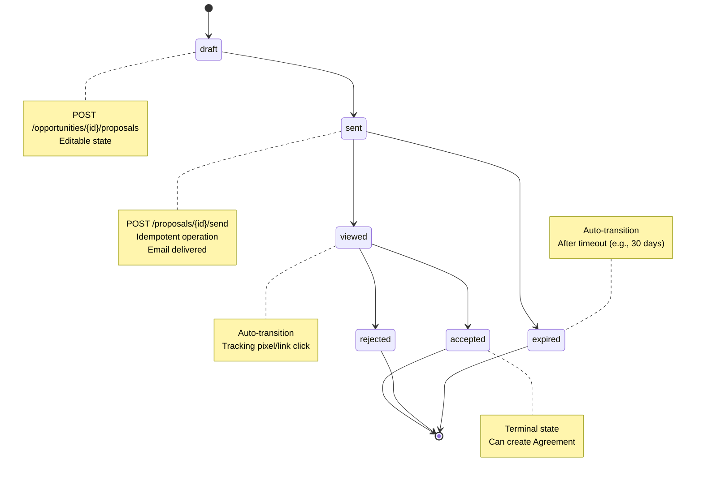

## State Machine: Agreement

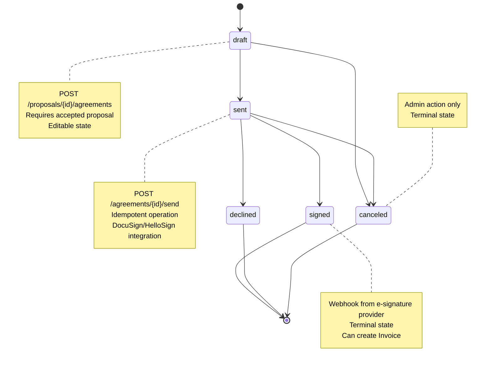

## State Machine: Invoice

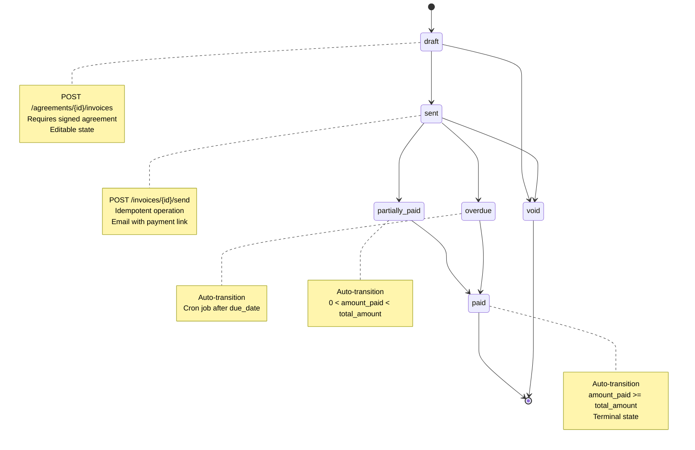

## State Machine: Payment

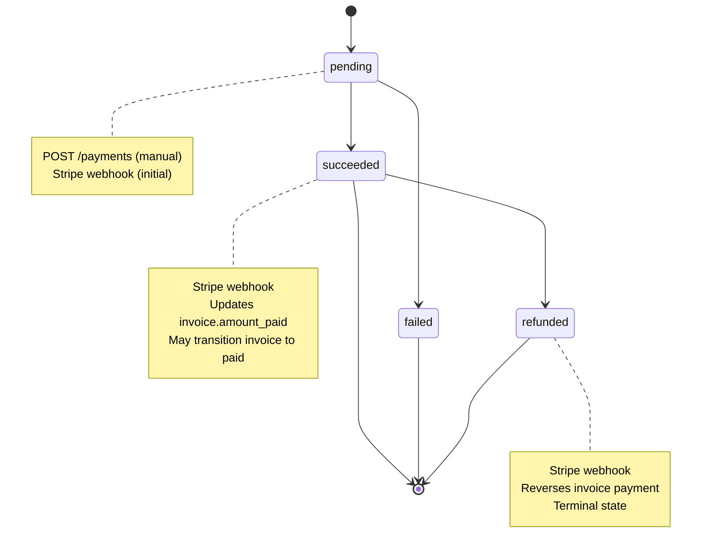

## State Machine: Meeting

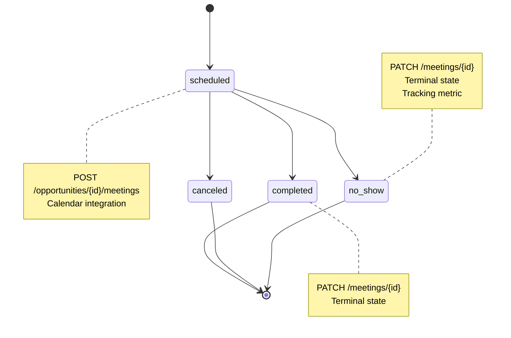

## Critical State Transitions & Validation

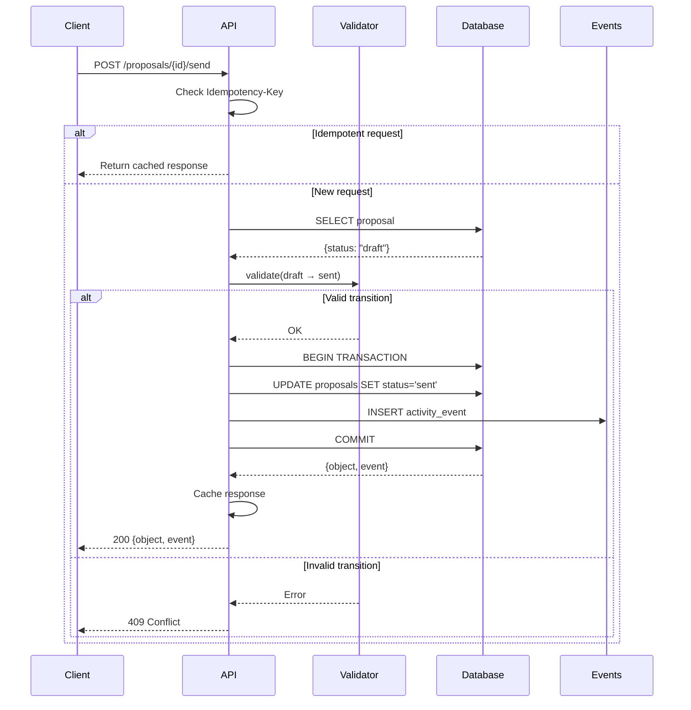

## Data Flow: Inquiry → Payment

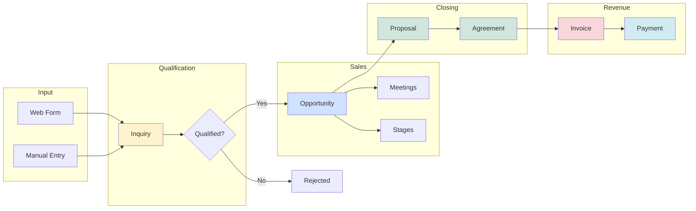

## Event Timeline Example

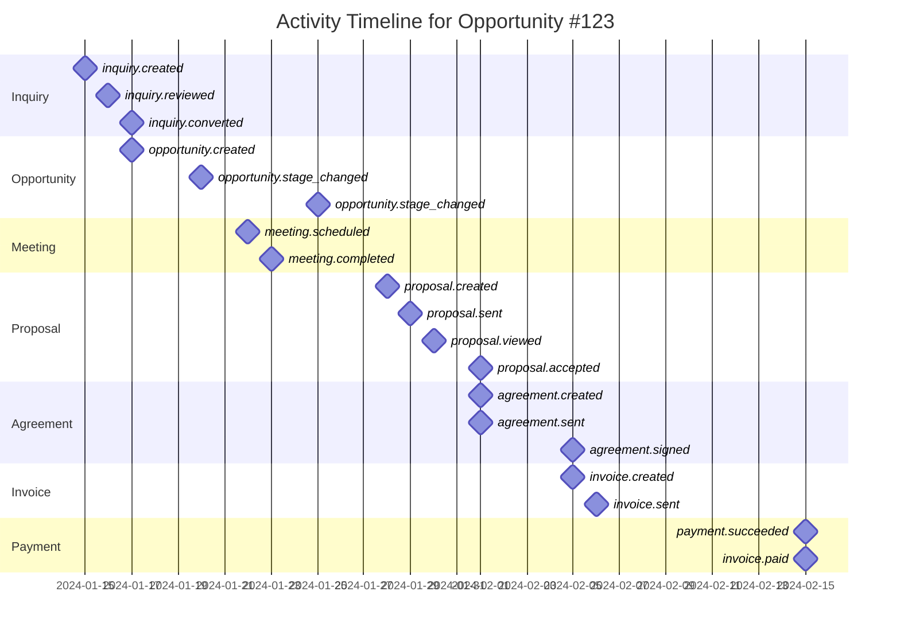
